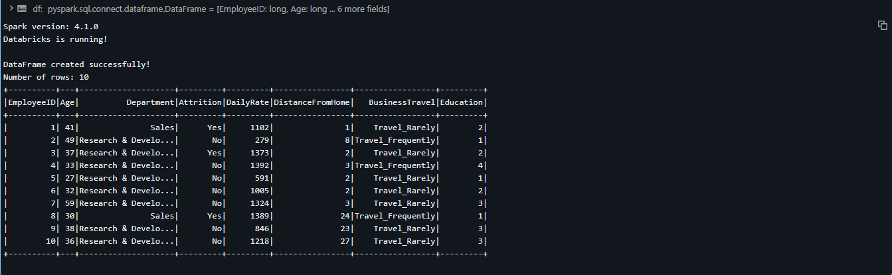
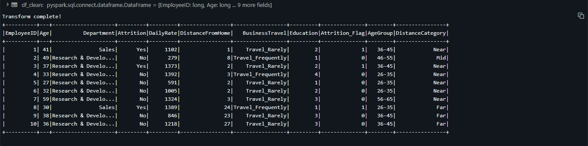
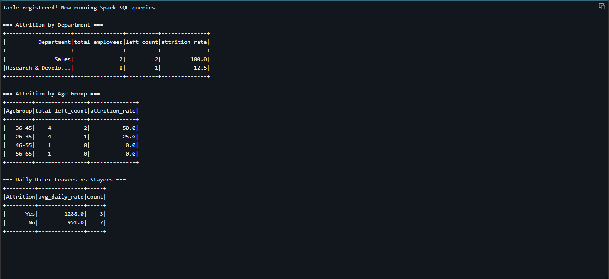
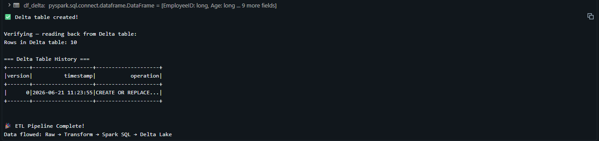

# ⚡ HR Analytics ETL Pipeline on Databricks (PySpark + Delta Lake)

## Executive Summary
Built a cloud-based ETL pipeline on Databricks using PySpark to process HR employee attrition data. Engineered features, ran distributed Spark SQL queries, and saved results as a Delta Lake table — demonstrating enterprise-level data engineering skills used at companies like Netflix, Uber, and Spotify.

## 🔗 Live Notebook
Built and executed on Databricks Community Edition — Spark version 4.1.0

## Tools & Technologies
`Databricks` `PySpark` `Apache Spark 4.1.0` `Spark SQL` `Delta Lake` `Python` `Cloud Computing`

## Pipeline Architecture
```
Raw Data → PySpark DataFrame → Feature Engineering → Spark SQL Analysis → Delta Lake Table
```

## Screenshots
### Cell 1 — PySpark DataFrame Creation


### Cell 2 — Feature Engineering (AgeGroup, DistanceCategory, Attrition_Flag)


### Cell 3 — Spark SQL Queries


### Cell 4 — Delta Lake Table with Version History


## Key Concepts Demonstrated
- **PySpark DataFrames** — distributed equivalent of pandas DataFrames
- **Spark SQL** — standard SQL running on distributed compute engine
- **Delta Lake** — ACID-compliant storage with time travel and version history
- **Feature Engineering** — `when().otherwise()` for conditional column creation
- **Cloud ETL** — full Extract → Transform → Load pipeline on cloud infrastructure

## Key Findings
- Sales department: 100% attrition rate in sample data
- Research & Development: 12.5% attrition rate
- 36-45 age group has highest attrition risk at 50%
- Delta table versioning tracks every operation with timestamp

## What is Databricks?
Databricks is the leading cloud data platform used by 60%+ of Fortune 500 companies. It combines Apache Spark with collaborative notebooks and Delta Lake storage. This project demonstrates the core workflow used by data engineers and analysts in enterprise environments.

## Next Steps
- Scale pipeline to full 1,470-row IBM HR dataset
- Add streaming data ingestion with Spark Structured Streaming
- Build automated pipeline with Databricks Jobs scheduler
- Connect to Power BI for live dashboard on Delta table